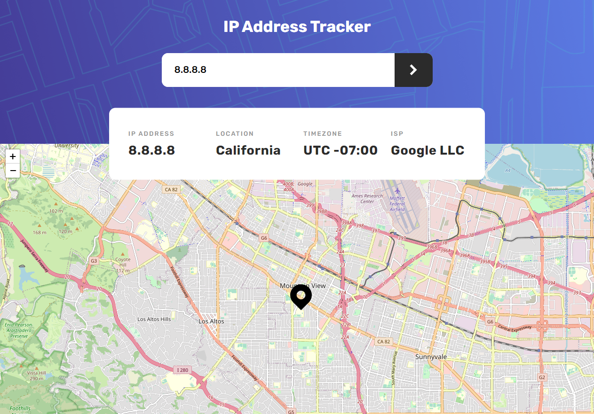

# Radalata

The IP Address Tracker is a web application developed using React, Tailwind CSS, and Express.js. It offers users a convenient and efficient way to track and obtain information about IP addresses. By simply entering an IP address, users can retrieve details such as the location, ISP (Internet Service Provider), and other relevant data associated with the IP address.


## Live Demo
You can access the live demo [here](https://emam546.github.io/ip-address-tracker/).

## Description

The IP Address Tracker application simplifies the process of tracking and gathering information about IP addresses. It provides a user-friendly interface where users can enter an IP address of their choice. The application then uses the entered IP address to retrieve and display various details related to that IP address.

## Features

- IP Address Tracking: Users can input an IP address into the application to initiate the tracking process. The application then retrieves information about the provided IP address, allowing users to gather insights such as the geographical location and ISP associated with the IP.

- Geolocation Data: The IP Address Tracker leverages external APIs and services to retrieve accurate geolocation data for the specified IP address. This includes details such as the country, region, city, latitude, and longitude.

- ISP Information: In addition to geolocation data, the application provides information about the ISP associated with the IP address. This includes the name of the ISP, along with other relevant details.

- Responsive Design with Tailwind CSS: The application's user interface is built using Tailwind CSS, a utility-first CSS framework. Tailwind CSS ensures a responsive design that adapts seamlessly to different screen sizes and devices.

- Efficient Backend with Express.js: Express.js powers the backend functionality of the IP Address Tracker, handling user requests and communicating with external APIs to retrieve IP address information. Express.js provides a reliable and scalable server environment.

## Getting Started

To run the project locally, follow these steps:

1. Clone the repository:

   ```shell
   git clone https://github.com/Emam546/ip-address-tracker
   ```
2. Install the dependencies:

   ```shell
   npm install
   ```

3. Start the development server:

    ```shell
   npm dev
   ```
****